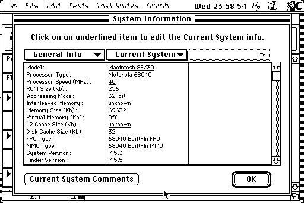

# Images for [Macintosh 'SE/40' (SE/30+BolleMac Carrera040@40MHz) : VintageApple](https://old.reddit.com/r/VintageApple/comments/lt9ctk/macintosh_se40_se30bollemac_carrera04040mhz/)

Since ImageUrl makes it extremely hard to archive their content in the Wayback Machine, here are the images for archival.

## Images

https://i.imgur.com/t9SVbNq.jpeg

https://i.imgur.com/eoHMNl7.jpeg

https://i.imgur.com/SUugPuK.jpeg

https://i.imgur.com/ACMp6zH.png

https://i.imgur.com/cHou7zc.png

